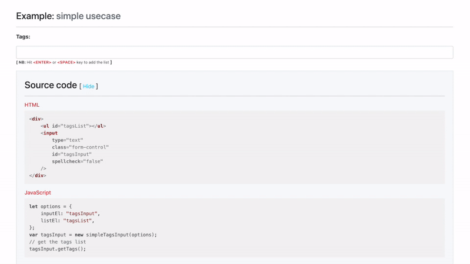
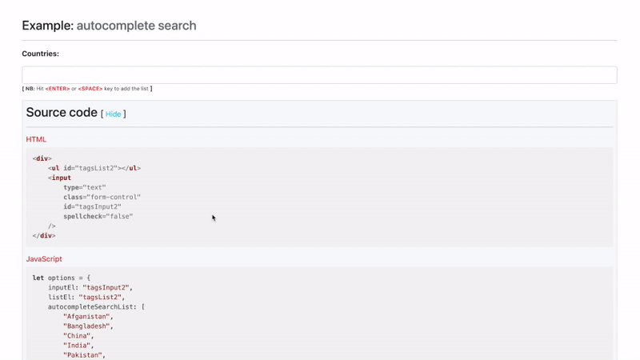

# simple-tags-input
Simple and extremely easy tags input for anything that runs on browser 🌐 🚀

## Quick start
```html
<!DOCTYPE html>
<html lang="en">
<head>
    <meta charset="UTF-8">
    <meta http-equiv="X-UA-Compatible" content="IE=edge">
    <meta name="viewport" content="width=device-width, initial-scale=1.0">
    <!--Simple tags input style-->
    <link rel="stylesheet" href="path/to/simple-tag-input.min.css">
</head>

<body>
    <div>
        <ul id="tagsList"></ul>
        <input 
            type="text" 
            id="tagsInput" 
            spellcheck="false" 
        />
    </div>

    <!--Simple tags input plugin-->
     <script src="path/to/simple.tagslist.min.js"></script>
     <!--Simple tags input implementation-->
     <script>
         let options = { inputEl: "tagsInput", listEl: "tagsList"};
         const tagsInput = new simpleTagsInput(options);
     </script>
</body>
</html>
        
```
## Usage
### Simple usecase
> Check the [example code here](./example/simple-demo.html)
```html
<!--HTML code-->
<div>
    <ul id="tagsList"></ul>
    <input 
        type="text" 
        class="form-control" 
        id="tagsInput" 
        spellcheck="false" 
    />
</div>
```
```javascript
/* JavaScript code */
let options = {
    inputEl: "tagsInput", 
    listEl: "tagsList",
};
var tagsInput = new simpleTagsInput(options);
// get the tags list/array [tag1, tag2, ...]
tagsInput.getTags();
```

**Demo**
> Basic usecase demo




### Autocomplete search usecase
> Check the [example code here](./example/autocomplete-demo.html)
```html
<!--HTML code-->
<div>
    <ul id="tagsList2"></ul>
    <input 
        type="text" 
        class="form-control" 
        id="tagsInput2" 
        spellcheck="false" 
    />
</div>
```
```javascript
/* JavaScript code */
let options = {
    inputEl: "tagsInput2", 
    listEl: "tagsList2",
    autocompleteSearchList: [
        "Afganistan", 
        "Bangladesh", 
        "China", 
        "India", 
        "Pakistan", 
        "Sri Lanka", 
        "United States", 
        "United Kingdom", 
        "Vietnam", 
        "Zimbabwe"
    ]
};
var tagsInputWithSearch = new simpleTagsInput(options);
// get the tags list/array [tag1, tag2, ...]
tagsInput.getTags();
```

**Demo**
> Basic usecase demo

